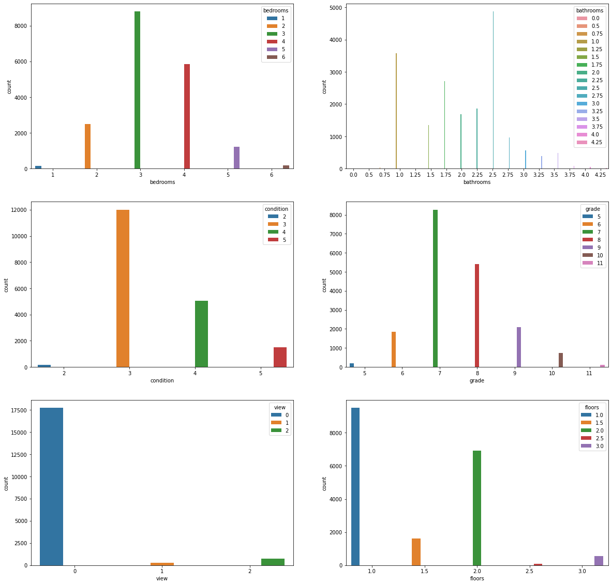
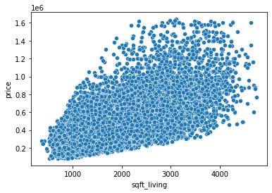
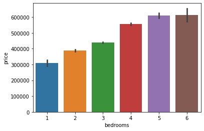
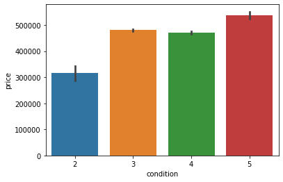
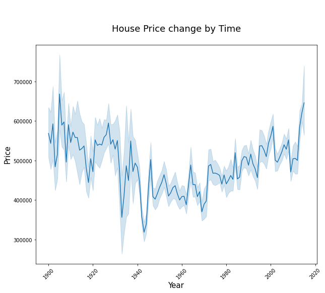
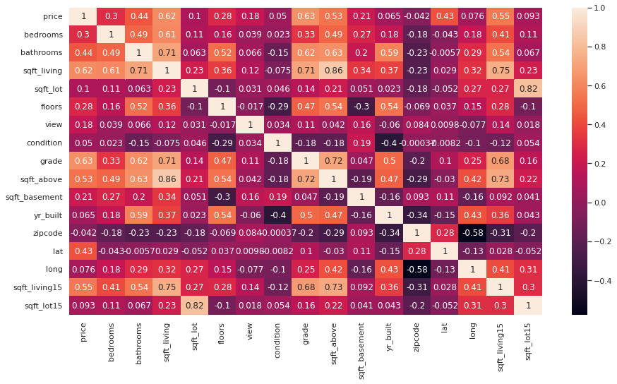

# Hass-Consulting-Company
Hass Consulting Company is a real estate firm that offers investment-grade developments all over Nairobi City. The developments offered have been conceptualized by their development team to be high quality assets using a data-driven approach in planning and design, that gears property for high rental returns and an escalated rate of capital growth.
# Specifying the Data Analytic Question
This is an analysis to study the factors that affect housing prices using information provided on real estate properties that was collected over a few months.A model with then be created, which will allow the company(Hass Consulting Company) to accurately predict the sale of prices upon being provided with the predictor variables.
# Defining the Metric of Success
The metric of success for this project is evaluate the factors affecting housing prices. Another metric of success building a model that can predic the sale price of house. The accuracy level of the prediction model should be atleast 85% to be termed as a good model.
# Recording the Experimental Data
For this project, I will perform the following actions:

1.Reading the data.

2.Checking the data.

3.Tidyingthe datasets Analysis. For the cleaning part, I will check for outliers, anomalies, missing values,checking for duplicates,dropping unnecessary columns and changing the column names into lowercase for uniformity and stripping off whitespaces and dashes.

4.I will the perform EDA (Univariate,Bivariate, and Multivariate).

5 Performing regression analysis.

-Incorporate categorical independent variables into your models.

-Check for multicollinearity.

-Perform regression analysis using the following techniques and access their performance, giving a recommendation of the best:

  1.Multiple Linear Regression
  
  2.Quantile Regression
  
  3.Ridge Regression
  
  4.Lasso Regression
  
  5.Elastic Net Regression
  
  6.Provide a recommendation based on your analysis.
  
-Create residual plots for your models, and assess heteroskedasticity using Barlett's test.

7.Challenge your solution by providing insights on how you can make improvements in model improvement.

# Exploratory Data Analysis

## Univariate

The image below shows the univariate analysis of various variables:

## Bivariate

The images below show how various sqft_living, bedrooms, and condition:

Heatmap showing the correlation of all the variables:

## Multivariate
